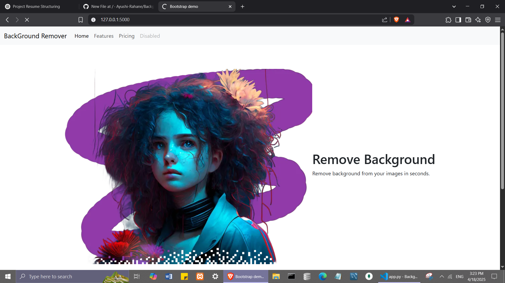

# 🖼️ Background Remover Web App

A simple Flask-based web application that allows users to **upload an image** and **remove its background in seconds** using the `rembg` deep learning library.

---

## 🚀 Screenshot

---

## 📸 Features

- 🔍 Upload any image and get background removed instantly
- ⚡ Uses deep learning (rembg) to ensure precise cut-outs
- 💾 Processes images directly in-memory (no file storage on disk)
- 🎨 Outputs clean, transparent background PNGs
- 🧰 Built with Flask and Bootstrap for a clean UI
- 📦 MongoDB setup for scalable file storage (using GridFS)

---

## 🛠️ Tech Stack

| Layer           | Technology Used              |
|-----------------|------------------------------|
| Frontend        | HTML, CSS, Bootstrap 5       |
| Backend         | Python, Flask                |
| Image Processing| rembg, Pillow (PIL)          |
| Database        | MongoDB, PyMongo, GridFS     |

---
